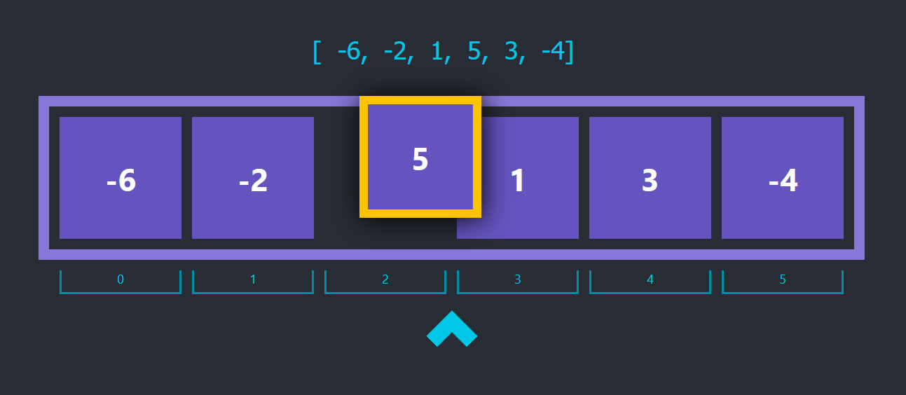

# Draggable Data Structures
A React tool to help you visualize data structure changes while you come up with an algorithm solution.

It should:
- allow you to drag, remove and swap the DS' items
- allow you to add pointers / cursors

___
  
 > This project was bootstrapped with [Create React App](https://github.com/facebook/create-react-app).

## Scripts

### `yarn start`

### `yarn test`

### `yarn build`

